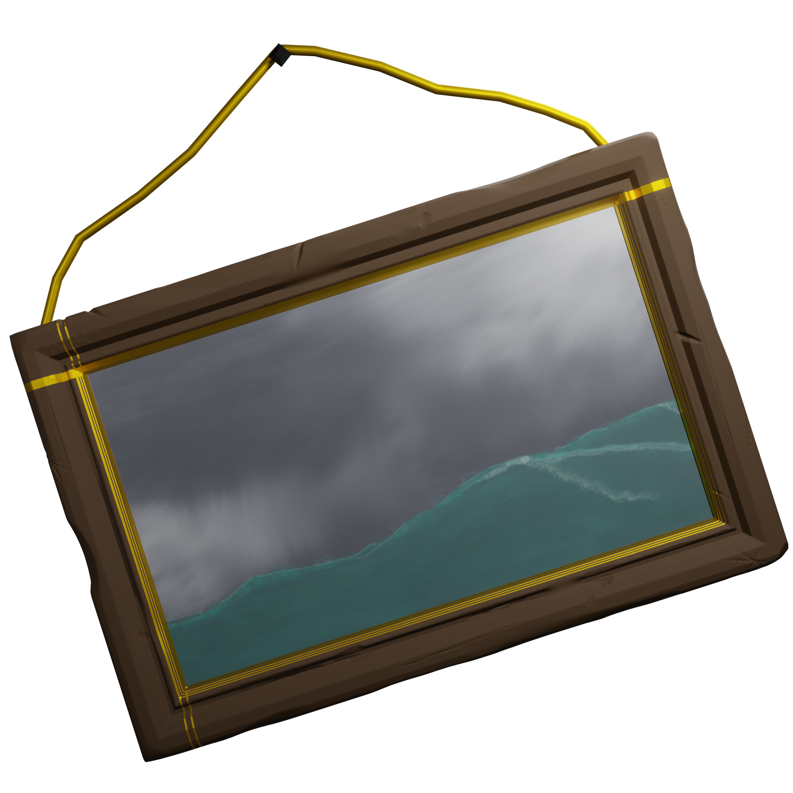

# Thief's Gambit

`(WIP - Still adding features and graphics. I need a couple more weeks.)`

## Description

A pirate themed, casino slots game.

One big part that I haven't implemented yet is the "Cheat" mechanic (as any pirate would do).

Motivation: _After EA games bought POGO, they rewrote their slots game to rely on real-money gems. Then, they rewrote their 20 year old algorithm to make the user deliberately lose so they have to buy more gems, or wait 6 hours for 10 more spins. When finished, my slots game will be free, with just as compelling gameplay. While POGO is turning away their loyal customers of 20+ years, I'll be welcoming them with free, fun gameplay._

## Navigate this repo

- /server: `Server Side Code`
  - /server/go: `The primary golang API of the game`.
    - User game data, game spins, game logic, login, signup, JWT's, Database ORM
  - /server/node: `The NodeJS, Express, SocketIO server that manages chat messages`
    - New messages, get messages for a chat room
- /graphics: `The art files`
  - All of the art files that I made by hand (In Blender and Krita)
- /client: `Javscript Code`
  - /client/src/
    - The ReactJS app of the website
  - /client/src/SlotsGame
    - Contains the actual game logic

## Technical

- Server
  - Game Logic API
    - The Primary API is written in Golang, uses the Fiber V2 framework (which is super similar to express), and GORM (Go ORM for working with relational databases).
    - The Postgres database running within a docker container, on a amazon linux server
    - The API creates and hands out JWT's to authenticated users. The JWT is stored in an HTTPOnly cookie.
  - Chat Message API
    - There is a secondary NodeJS Express/SocketIO Api that handles live chat messages.
- Client
  - The client application is React (create-react-app)
  - Rather than build every piece from scratch as I usually do, I used PIXI.js to "help" (wasn't any easier) with rendering sprites and loading game assets.

- Flow of data
  - Client logs in, receives a JWT, passes the JWT on all future requests
  - Each "Spin", the client asks the server for results. Client has no logic or control of their own fate. Server builds a board, evaluates it, and returns the results. This is muuuuuch more tamper proof than all logic being in javascript, where the user can manipulate it.

## Art

I made the art by creating 3d things in blender, and taking 2d renders of them. I drew a couple things (the ocean painting) in Krita.

`Current progress (looks very blocky, but will look much better by the end)`

<table>
  <tbody>
    <tr>
    <td>
      
    </td>
    <td>
      
    </td>
    </tr>
    <tr>
    <td>
      
    </td>
    <td>
      
    </td>
    </tr>
  </tbody>
</table>